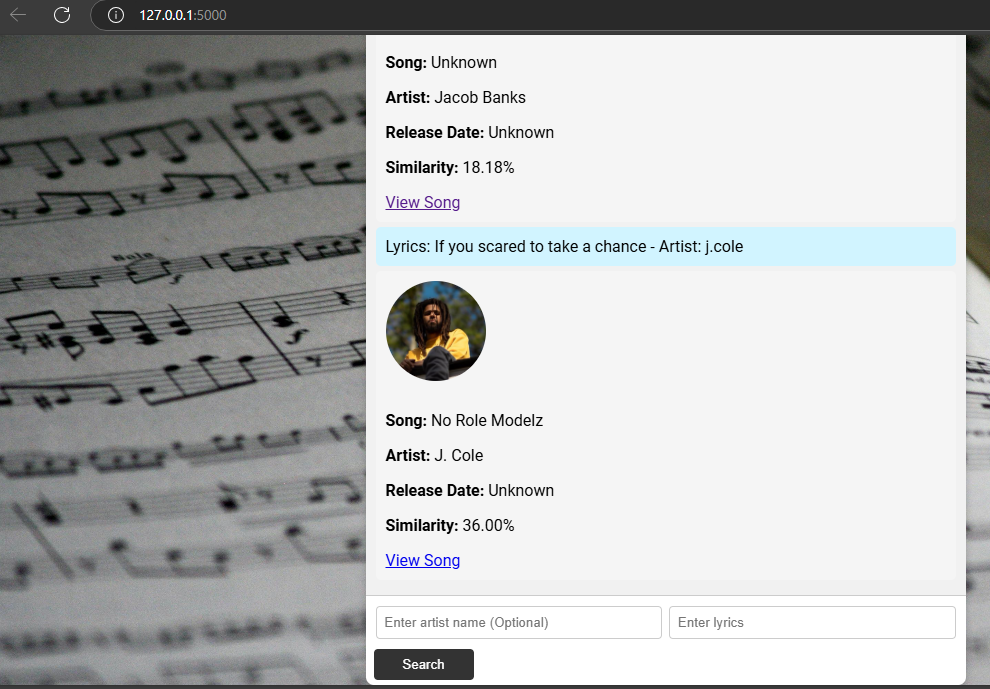

# Lyrics Finder

Lyrics Finder is a web application that allows users to search for songs by entering lyrics and the artist's name. The app leverages the Genius API to find matching songs and provide details such as the song's title, artist, release date, and a link to the lyrics. The project is built using Flask for the backend and HTML, CSS, and JavaScript for the frontend.

## Features

- Search for songs by entering lyrics and the artist's name.
- Display song details including title, artist name, release date, and artist image.
- Provide a link to the song's lyrics on Genius.
- Simple and responsive user interface.

---

## Technology Stack

### Backend
- **Python**: For server-side logic.
- **Flask**: Lightweight web framework for handling API requests and rendering templates.
- **Genius API**: Used to search for songs and fetch metadata.

### Frontend
- **HTML**: For structuring the webpage.
- **CSS**: For styling the application.
- **JavaScript**: For dynamic content handling and API requests.

### External Libraries
- **requests**: For making HTTP requests to the Genius API.
- **difflib**: For comparing input lyrics to fetched lyrics and finding the best match.

---

## Installation and Setup

### Prerequisites
1. Python 3.x installed on your system.
2. Genius API access token. Sign up at [Genius API](https://genius.com/api-clients) to get an API key.

### Steps

1. Clone the repository:
   ```bash
   git clone https://github.com/your-username/lyrics-finder.git
   cd lyrics-finder
   ```

2. Create a virtual environment and activate it:
   ```bash
   python -m venv venv
   source venv/bin/activate   # For Linux/Mac
   venv\Scripts\activate    # For Windows
   ```

3. Install the required dependencies:
   ```bash
   pip install -r requirements.txt
   ```

4. Add your Genius API token in `app.py`:
   ```python
   GENIUS_API_TOKEN = 'your_genius_api_token'
   ```

5. Run the application:
   ```bash
   python app.py
   ```

6. Open your browser and navigate to `http://127.0.0.1:5000`.

---

## Project Structure

```
lyrics-finder/
|-- templates/
|   |-- index.html   # Main frontend template
|-- static/
|   |-- styles.css   # CSS file for styling
|-- app.py           # Flask backend
|-- requirements.txt # Dependencies
```

---

## Usage

1. Open the web application in your browser.
2. Enter the artist's name in the "Artist Name" input field.
3. Enter part of the song lyrics in the "Lyrics" input field.
4. Click the "Search" button.
5. View the song details displayed in the chat interface, including:
   - Song title
   - Artist name
   - Release date
   - A link to the song's lyrics

---

## API Integration

### Genius API
The Genius API is used to:
- Search for songs based on user input.
- Retrieve metadata such as title, artist, and release date.

#### Example Request
```python
headers = {'Authorization': f'Bearer {GENIUS_API_TOKEN}'}
response = requests.get('https://api.genius.com/search', headers=headers, params={'q': artist_name})
```

---

## Frontend Design

- **Responsive Layout**: The application is designed to be visually appealing on all screen sizes.
- **Input Validation**: Ensures both the lyrics and artist name are provided before searching.
- **User Feedback**: Displays error messages if no results are found or if input is incomplete.

---

## Future Improvements

- **Enhanced Lyrics Matching**: Use advanced NLP models for better lyric matching.
- **Autocomplete Suggestions**: Add autocomplete for artist names.
- **Mobile Optimization**: Improve layout and usability on smaller screens.
- **Additional APIs**: Integrate other music databases for more extensive results.

---

## License

This project is licensed under the MIT License. See the LICENSE file for details.

---

## Contributing

Contributions are welcome! Feel free to submit a pull request or report issues in the repository.

---

## Contact

For questions or support, contact:
- **Name**: Bassey Eyo Inyang
- **Email**: basseyeyo991@gmail.com

---

## Screenshots


